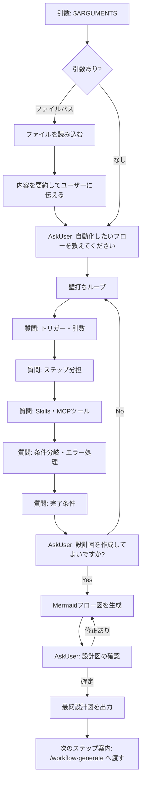

## Workflow設計図

**コマンド名（案）**：workflow-design
**説明**：ユーザーと壁打ちしながら要件を整理し、Workflowの設計図（Mermaidフロー図）を生成するアシスタントコマンド
**引数**：`$ARGUMENTS`（任意）— アイデアを記載したMarkdownファイルのパス、または省略可

### フロー図

### 使用するコンポーネント

- **サブエージェント**：なし
- **Skills**：なし（壁打ちはClaudeが直接担当）
- **MCPツール**：なし

---

次のステップ：`/workflow-generate` にこの設計図を渡してMarkdownを生成してください。
